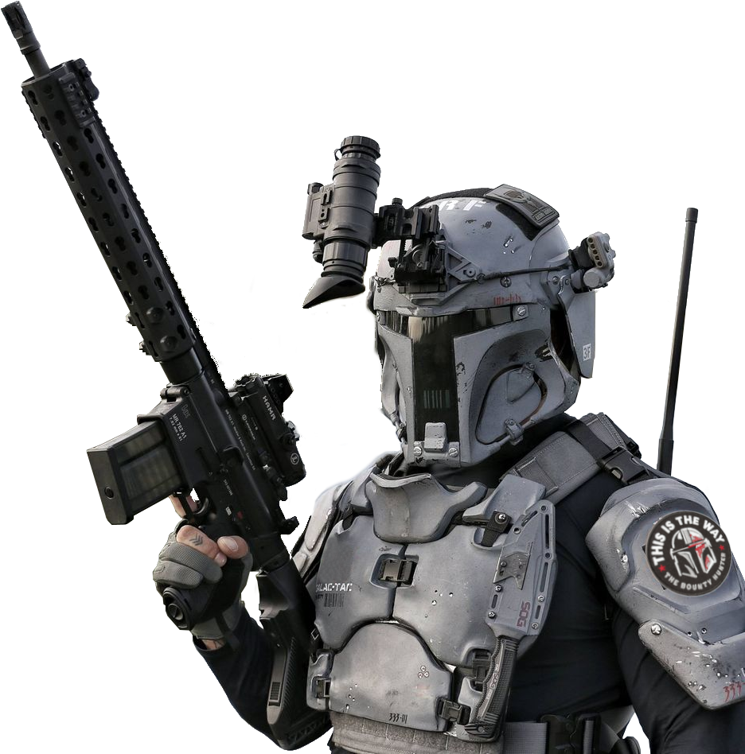
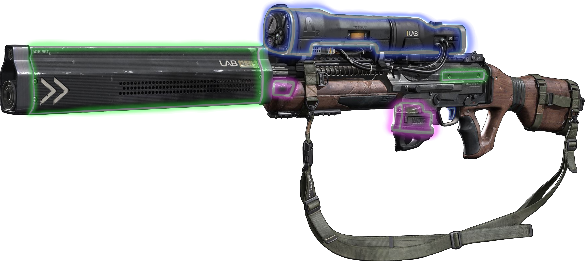

WORK IN PROGRESS CONTENT
{: .label .label-red }

# Item Modifications
While many Enhanced Items come with fixed effects. Other Enhanced Items, called Item Modifications, allow you to customize other items you find on your adventures. 

## Modifiable Equipment
Installing Item Modifications requires three things: an Item Modification to install, an item matching its type, and the appropriate tools for those items. An item can only be modified by someone proficient with appropriate tools, as shown in the *Types of Item Modifications* table.

For example: to install an Accuracy Focus Mk II you require a blaster/ranged weapon as well as Armstech's Implements to install it into.

### Types of Item Modifications



- [Armor]() - Armormech's Implements
- [Blasters]() - Armstech's Implements
- [Clothing]() - Synthweaver's Implements
- [Focus Generators]() - Artificer's Implements
- [Lightweapons]() - Artificer's Implements
- [Shields]() - Armormech's Implements
- [Vibroweapons]() - Armstech's Implements
- [Wristpads]() - Cybertech's Implements

There are also special kinds of Item Modifications called Augments, detailed [here]().

## Modifiable Item slots

Every Item can install up to two Item Modifications, determined by its type, in addition to Augments. Additionaly, installing an Item Modification into an item causes that item to require Attunement if it didn't already.

```Item Modifications are no longer restricted by Rarity, allowing any Rarity of Item Modification to be installed into any Rarity of item (including unenhanced)```

When two or more modifications with the same effects are installed into an item, only the most potent effects apply. For example, if modification A adds +1 to damage and modification B adds +2 to damage, only the +2 to damage applies, giving the weapon +2 bonus to damage rolls rather than +3. Additionally, if modification A instead has +1 to damage and keen 1, it would still apply keen 1 to the item. 

However, negative bonuses are always applied. For instance: if modification A instead has -1 to damage and +1 to attack rolls and modification B adds +2 to damage, the -1 to damage still applies, resulting in only +1 to damage with the weapon.

## Installing and Removing Modifications



Installing or Removing an Item Modification takes one hour and requires an ability check with the appropriate tool, as shown in the *Types of Item Modifications* table. The DC for the check is determined by the rarity of the Item Modification being installed, as shown below in the [*Installation/Removal DC by Rarity*](https://drakeryzer.github.io/DrakeSW5E/Enhanced%20Items/Modifiable%20Items/#installationremoval-dc-by-rarity) table.

- On a successful installation, the Item Modification is correctly installed. On a failure, the Item Modification is not installed, and you must wait 24 hours before you can try again.
- On a successful removal, the Item Modification is removed and salvaged. On a failure, the Item Modification is removed but destroyed.

#### Installation/Removal DC by Rarity

| Rarity  | Installation/Removal DC | Rarity  | Installation/Removal DC |
|:---:|:-----------:|:---:|:-----------:|
|<font style="color:gray">Standard</font>|10|<font style="color:fuchsia">Advanced</font>|22|
|<font style="color:lime">Premium</font>|14|<font style="color:orange">Legendary</font>|26|
|<font style="color:cyan">Prototype</font>|18|<font style="color:red">Artifact</font>|30|

### Variant Rule: Common Modifications
Modifying equipment is a common expectation of adventurers foraying through the worlds of *Star Wars*. 

This rule treats all unenhanced Items that can potentially be Modifiable Items, the eight categories listed earlier in this chapter, as unmodified standard rarity *Modifiable Items*. 

For example, every unenhanced blaster rifle you find while adventuring, or for sale in a market, comes with four vacant modification slots for standard rarity blaster modifications.

Additionally, all modifications of standard rarity should be available for purchase from appropriate vendors without using the *Buying Enhanced Items* downtime activity.

> Note that all *Modifiable Items* of standard rarity should be considered unenhanced for the purposes of overcoming resistance as well as distribution.
> 
> Premium or higher rarity should still be treated as Enhanced Items for the purposes of overcoming resistance as well as distribution.

# Engineers and Item Modifications
Many Engineer archetypes are built around modifying a specific item, such as an Armstech or Armormech Engineer. If you have any of these engineers at the table, while using this book, you'll want to include the following rules:
- An Engineer's class-specific *Modified Item* only ever counts as one Attunement, regardless of the rarity of the modifications inside it.
- An Engineer's class-specific *Modified Item* is not restricted to using *Enhanced Item Modifications* of a certain rarity. 
  - For instance, if a 4th-level armstech engineer comes across an artifact rarity blaster modification, and they are skilled enough to install it, they can benefit from it.
- An Engineer's class-specific *Modified Item* can include up to two augments, which count towards their *Total Modifications*.
- *Enhanced Item Modifications* installed into an Engineer's class-specific *Modified Item*, must still be installed over time with a successful ability check.
- An Engineer’s class-specific *Modified Item* can apply the effects of both their class-specific modifications as well as *Enhanced Item Modifications* from this book, to a maximum bonus of 3. 
  - For instance, an Armstech Engineer with their Accuracy Focus class-specific modification, as well as the Accuracy Focus Mk II enhanced modification applies the +1 to weapon attacks from both, for a total of +2 at 5th-level or +3 at 9th level, but not to +4 at 13-level. However, the bonuses from two or more *Enhanced Modifications* are still limited to the highest values and negatives are still applied.

### Biotech Engineers
The Biotech Engineering archetype however uses the following rules:
- *Enhanced Cybernetics* can be installed past your *Cybernetic Limit* (as described under *Cybernetics*) using your *Total Modifications* for this archetype.
- *Enhanced Cybernetics* still count towards the *Cybernetic Side Effects table*.
- *Biotech Engineering Cybernetics* do not count towards the *Cybernetic Side Effects table*.
- Biotech Enginners can apply the effects of both their *Biotech Engineering Cybernetics* as well as *Enhanced Cybernetics* from this book, to a maximum bonus of 3.

A Biotech Engineer using the *Variant: Droids* rule from their archetype, would instead replace Enhanced Cybernetics with Enhanced Droid Customizations for the above rules.

# Color Crystals
In addition to the modifications unique to themselves, all lightweapons come with an additional slot for a color crystal. Typically, newly created lightweapons come with one of the more common color variants, such as green, blue, or red. 

Occasionally, a character might come across a more scarce color crystal. When determining what color crystal a lightweapon comes with or is found as loot, the GM can choose for the player, or have the player make a universal forcecasting ability check with proficiency. The result of the check affects the color of the crystal, as shown below in the [Forcecasting Color Crystal Modifier](https://drakeryzer.github.io/DrakeSW5E/Enhanced%20Items/Modifiable%20Items/#forcecasting-color-crystal-modifier) table.

#### Forcecasting Color Crystal Modifier

|Forcecasting<br> Ability Check DC|d100 Roll<br>Item modifier|
|:--:|:--:|
| 1|-15|
| 5|-10|
|10| -5|
|15|  0|
|20| +5|
|25|+10|
|30|+20|

> The **d100 Roll Modifier** is added to the percentile dice rolled for the Color Crystal table, which is discussed below.

Once a player has made their forcecasting ability check to discover a lightweapon color crystal, the player rolls percentile dice and consults the Color Crystal table below, applying a modifier based on the result of their forcecasting ability check.

#### Color Crystal

|d100|Crystal Color|d100|Crystal Color|
|:--:|:--:|:--:|:--:|
|1-20|Blue|91-93|Viridian|
|21-40|Red|94-96|Cyan|
|41-60|Green|97|Bronze|
|61-70|Yellow|98|Silver|
|71-80|Purple|99|White|
|81-90|Orange|100+|Black|

> This table includes the most common and desirable color crystals. More extensive options can be awarded at the discretion of the GM.

A player can choose the color crystal that is the result of their percentile dice rolled, or they can choose one that falls below it. For instance, if the player rolls a 91 and finds a viridian color crystal, they could instead choose a yellow color crystal, as if they had rolled a 63.

